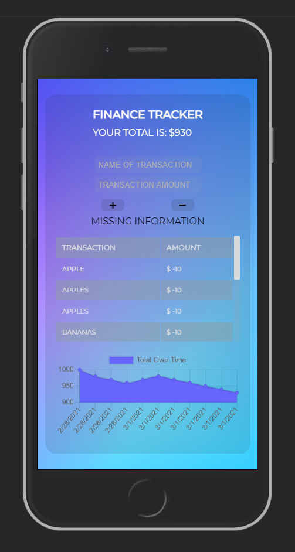
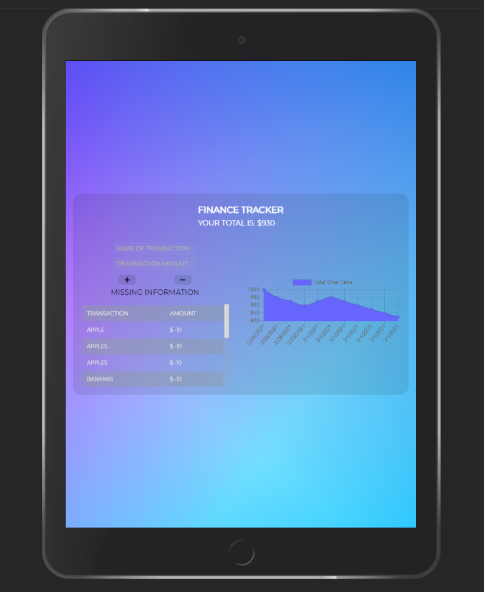
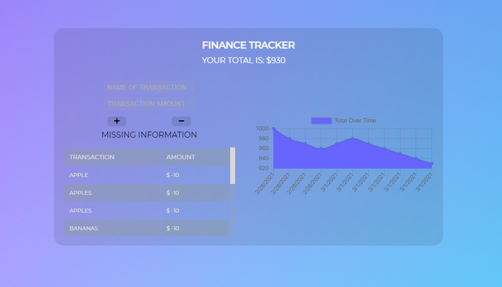

# Finance Tracker

## Description

An application made to record user's finances for online and offline uses.

## Table of Contents

* [Features](#Features)
* [Links](#Links)
* [Demo](#Demo)
* [Technology](#Technology)
* [Contributors](#Contributors)
* [Questions](#Questions)
* [License](#License)

## Features

User Experience:
    
    User can add a budget.
    
    User can add items with a cost.
    
    User can subtract expenses.

Offline Functionality:

    Enter deposits offline.

    Enter expenses offline.

When brought back online:

    Offline entries should be added to tracker.

## Links

* Project Repo: [Repository](https://github.com/jeishu/finance-tracker)
* Deployed Application: [Finance Tracker](https://glassmorphism-finance-tracker.herokuapp.com/)

## Demo

## Technology

Langauges:

    HTML, CSS, Javascript

Technologies:

    Compression, Express, Lite-server, Mongoose, Morgan

Deployment:

    Heroku, MongoDB Atlas

## Contributors

Code originated from UT Austin Bootcamp. Additional code was added to make the application work. Deployment was done using Heroku and MongoDB Atlas.

## Questions
If you have any question about the application, don't hesitate to contact me: visit my [portfolio](https://github.com/jeishu).

## License

MIT © 2021 Jeremy Zhu
